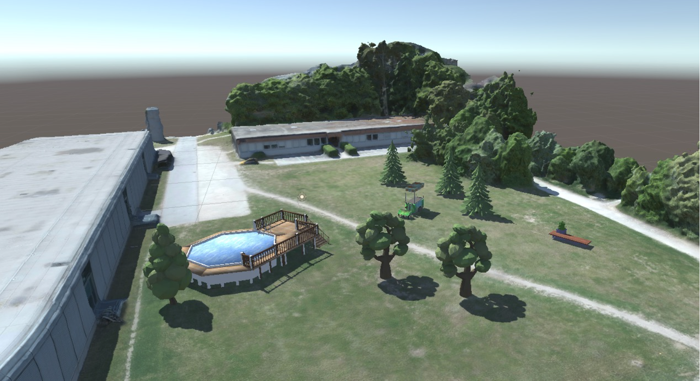

# GardenVR

Mobile app developed in Unity for Android as part of a feasibility study on the use of VR technology in professional VET.
<br>Hardware used:
- Samsung S7 Edge
- GearVR
- GearVR Controller

<br>How to install:
1. Clone this repo
```
$ git clone https://github.com/jshwl/GardenVR.git
$ cd GardenVR
```

2. Add your OSIG file (obtained from Oculus) to the GardenVR/Assets/Plugins/Android/assets/ folder.

3. Build the project in Unity.

4. Transfer the .apk file to your mobile device and install the app.

5. Open the app, insert the mobile device in the GearVR headset.


